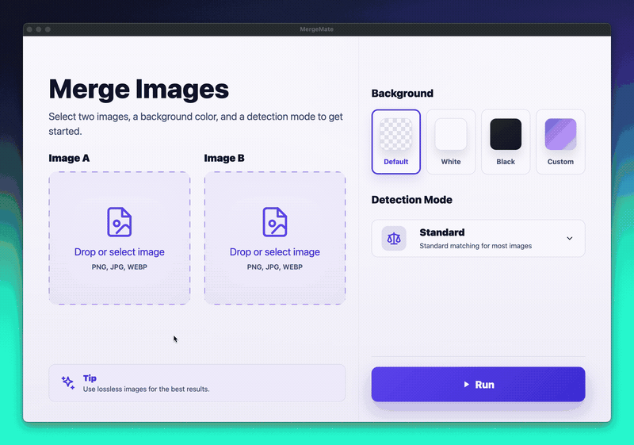

# Eagle | MergeMate Plugin

An Eagle window plugin for automatically aligning two images, comparing merge previews, fine-tuning offsets, and exporting it.

## Features

- Align two images automatically
- Preview merged, overlay, difference, and quality views
- Review alignment candidates
- Manually adjust offsets
- Export the merged result

## Requirements

- Eagle 4.0 Build 23 or later
